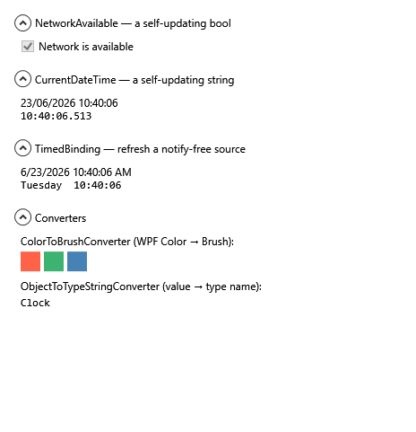

# Self-updating Bindings in WPF

> A walk-through of two of WPF's most under-used extension points — **custom markup extensions** and
> **value converters** — by building bindings that *keep updating themselves* after they're created: a
> live clock, a live network-status flag, and a binding that refreshes a source which never raises a
> change notification.

*By Richard Potter. The source discussed here lives in this repository under `src/`.*



**Contents**

- [Introduction](#introduction)
- [The problem: a binding only fires when told](#the-problem-a-binding-only-fires-when-told)
- [What a markup extension actually is](#what-a-markup-extension-actually-is)
- [The key trick: remembering your target](#the-key-trick-remembering-your-target)
- [Polling: a live clock and a live network flag](#polling-a-live-clock-and-a-live-network-flag)
- [Wrapping a real Binding: TimedBinding](#wrapping-a-real-binding-timedbinding)
- [Value converters (and one that is its own markup extension)](#value-converters-and-one-that-is-its-own-markup-extension)
- [One tidy xmlns](#one-tidy-xmlns)
- [Running it](#running-it)
- [Going further](#going-further)
- [Summary](#summary)
- [Acknowledgement](#acknowledgement)

---

## Introduction

WPF's data binding is famously powerful, but it has a blind spot that trips everyone up eventually:
**a binding updates only when the source tells it to.** If your source raises
`INotifyPropertyChanged`, great. If it doesn't — `DateTime.Now`, a network flag, a sensor reading,
anything that changes on its own — a plain binding reads it *once* and then sits there, frozen,
forever.

This tutorial builds a small, reusable library, `RP.Wpf.Bindings`, that fixes exactly that, and in
doing so teaches the two XAML extension points most people never write themselves. The demo window
that exercises it has **zero lines of code-behind** — every live value on it is produced from XAML.

The original version of this project was a scratch "test app" that referenced these extensions from a
private utility library; here they are rebuilt from first principles, explained, and made
self-contained.

## The problem: a binding only fires when told

Put this in a window and watch it never change:

```xml
<TextBlock Text="{Binding Source={x:Static sys:DateTime.Now}}" />
```

`x:Static` evaluates `DateTime.Now` once, at parse time, and binds to that frozen value. There is no
source object and certainly no change notification, so the text is stuck at the moment the window
loaded. We want a binding that goes back and *re-reads* the time. To build that, we need to extend
XAML itself.

## What a markup extension actually is

Anything in XAML written as `{Something …}` is a **markup extension** — `{Binding}`, `{StaticResource}`
and `{x:Static}` are all just classes. You can write your own: derive from `MarkupExtension` and
override one method, `ProvideValue`, which returns the value XAML should assign to the target property.

```csharp
public sealed class HelloExtension : MarkupExtension
{
    public override object ProvideValue(IServiceProvider serviceProvider) => "hello";
}
```

```xml
<TextBlock Text="{local:Hello}" />   <!-- renders: hello -->
```

That's the whole contract. The catch — and the entire point of this tutorial — is that `ProvideValue`
is called **once**. To keep updating the target afterwards, the extension has to remember *what* it was
applied to.

## The key trick: remembering your target

When XAML calls `ProvideValue`, it passes an `IServiceProvider` from which you can request an
`IProvideValueTarget`. That service tells you the **target object** and **target property** the
extension is being assigned to. If we record those, we can push new values into them later — on a
timer, or from an event.

That bookkeeping is the job of the base class
[`TargetUpdatableMarkupExtension`](src/RP.Wpf.Bindings/Markup/TargetUpdatableMarkupExtension.cs):

```csharp
public sealed override object ProvideValue(IServiceProvider serviceProvider)
{
    if (serviceProvider.GetService(typeof(IProvideValueTarget)) is IProvideValueTarget target &&
        target.TargetObject is not null)
    {
        if (target.TargetObject.GetType().FullName == "System.Windows.SharedDp")
            return this;   // inside a template the real target isn't known yet — defer

        if (!_targetObjects.Contains(target.TargetObject))
            _targetObjects.Add(target.TargetObject);

        TargetProperty = target.TargetProperty;
    }

    return ProvideValueInternal(serviceProvider);   // derived classes produce the first value here
}
```

Two subtleties are worth calling out, because both cost people hours:

- **The `SharedDp` dance.** Inside a `ControlTemplate` or `DataTemplate`, XAML evaluates the extension
  against a *shared* placeholder before the real targets exist. Returning `this` for that placeholder
  tells WPF "ask me again per instance," so the extension works inside templates too.
- **Thread marshalling.** When we later push a value with `SetTarget`, a dependency property must be
  set on its owning thread. The base checks `dependencyObject.CheckAccess()` and uses the
  `Dispatcher` when needed — so an event that arrives on a background thread (network changes do) still
  updates the UI safely.

With the hard part in the base class, each *useful* extension becomes tiny.

## Polling: a live clock and a live network flag

Most "self-updating" values are just a source you re-read periodically. The base
[`TimedUpdatableMarkupExtension<T>`](src/RP.Wpf.Bindings/Markup/TimedUpdatableMarkupExtension.cs) owns
a `DispatcherTimer`, polls an abstract `GetSource()`, and pushes the result **only when it changes**
(so we're not churning the UI every tick). A live clock is then four lines:

```csharp
public sealed class CurrentDateTimeExtension : TimedUpdatableMarkupExtension<string>
{
    public string? StringFormat { get; set; }
    protected override string GetSource() => DateTime.Now.ToString(StringFormat, FormatProvider);
}
```

```xml
<TextBlock Text="{rp:CurrentDateTime Delay=0:0:0.05, StringFormat=HH:mm:ss.fff}" />
```

The [network flag](src/RP.Wpf.Bindings/Markup/NetworkAvailableExtension.cs) shows the *other* update
source — an **event** rather than a timer. It subscribes to `NetworkChange.NetworkAvailabilityChanged`
and calls `SetTarget` when connectivity flips:

```csharp
public NetworkAvailableExtension() =>
    NetworkChange.NetworkAvailabilityChanged += OnNetworkAvailabilityChanged;

private void OnNetworkAvailabilityChanged(object? s, NetworkAvailabilityEventArgs e) => SetTarget(e.IsAvailable);
```

```xml
<CheckBox IsChecked="{rp:NetworkAvailable}" Content="Network is available" />
```

Same base, two completely different update mechanisms — timer vs event — and neither needs the source
to implement `INotifyPropertyChanged`.

## Wrapping a real Binding: TimedBinding

The extensions above *produce* a value. Sometimes you instead want all the power of a normal `Binding`
— a `Source`, a `Path`, a `Converter`, a `StringFormat` — but pointed at a property that changes
silently. [`TimedBinding`](src/RP.Wpf.Bindings/Markup/TimedBindingExtension.cs) does that: it builds a
genuine one-way `Binding`, then nudges it on a timer by calling `UpdateTarget()`:

```csharp
protected override object ProvideValueInternal(IServiceProvider serviceProvider)
{
    var binding = MakeBinding();
    binding.Mode = BindingMode.OneWay;
    var value = binding.ProvideValue(serviceProvider);   // hand XAML a real BindingExpression
    _timer.Start();
    return value;
}
```

```xml
<!-- Clock.Now raises no change notification; TimedBinding re-pulls it twice a second. -->
<TextBlock Text="{rp:TimedBinding Source={StaticResource Clock}, Path=Now, StringFormat=HH:mm:ss}" />
```

The demo's `Clock` is deliberately the dumbest possible source — a class with one property,
`Now => DateTime.Now`, and no notifications at all. A plain `{Binding}` against it freezes; the
`TimedBinding` stays live. That contrast *is* the lesson.

## Value converters (and one that is its own markup extension)

A converter implements `IValueConverter` to transform a bound value on its way to the UI. The library
ships three:

- [`ColorToBrushConverter`](src/RP.Wpf.Bindings/Converters/ColorToBrushConverter.cs) — turns a colour
  into a `SolidColorBrush`, accepting **either** a WPF `Color` or a `System.Drawing.Color`, and converts
  back. (Bindings want a `Brush`; lots of sources give you a `Color`.)
- [`ObjectToTypeStringConverter`](src/RP.Wpf.Bindings/Converters/ObjectToTypeStringConverter.cs) — a
  one-liner that renders a value's runtime type name, handy for diagnostics.
- [`ObjectToStringConverter`](src/RP.Wpf.Bindings/Converters/ObjectToStringConverter.cs) — formats a
  value (honouring a format string) and joins a *collection* one formatted item per line.

That last one demonstrates a neat pattern: it is **both** an `IValueConverter` **and** a
`MarkupExtension`. By deriving from `MarkupExtension` and returning itself, it can be used inline with
a constructor argument — no `<…x:Key>` resource needed:

```csharp
public sealed class ObjectToStringConverter : MarkupExtension, IValueConverter
{
    public override object ProvideValue(IServiceProvider serviceProvider) => this;
    // …Convert/ConvertBack…
}
```

```xml
<TextBlock Text="{rp:TimedBinding Source={StaticResource Clock}, Path=Now,
                                  Converter={rp:ObjectToStringConverter 'dddd  HH:mm:ss'}}" />
```

## One tidy xmlns

Finally, a small quality-of-life touch. Rather than make consumers declare a `clr-namespace` for the
markup folder *and* one for the converters folder, the library maps both onto a single XML namespace in
[`AssemblyInfo.cs`](src/RP.Wpf.Bindings/Properties/AssemblyInfo.cs):

```csharp
[assembly: XmlnsDefinition("https://schemas.richardpotter.dev/wpf", "RP.Wpf.Bindings.Markup")]
[assembly: XmlnsDefinition("https://schemas.richardpotter.dev/wpf", "RP.Wpf.Bindings.Converters")]
[assembly: XmlnsPrefix("https://schemas.richardpotter.dev/wpf", "rp")]
```

So a consumer writes one line — `xmlns:rp="https://schemas.richardpotter.dev/wpf"` — and reaches
everything, exactly as you reach all of WPF through one default namespace.

## Running it

Requires the [.NET 8 SDK](https://dotnet.microsoft.com/download) (or newer) on Windows.

```bash
cd src/RP.Wpf.Bindings.Demo
dotnet run
```

You should see a window with a ticking clock, a network-status checkbox, a `TimedBinding`-driven clock
(plain and converter-formatted), and the colour/type converters — all driven from XAML.

## Going further

- **A `FileWatcher` extension** that pushes a file's contents on `FileSystemWatcher` events — the same
  event-driven shape as `NetworkAvailable`.
- **Unsubscribe properly.** The event-based extensions hold a subscription for the app's life; a
  production version would use a weak event or detach when the last target is unloaded.
- **Make the timed extensions share one timer** rather than one per binding, if you scatter hundreds of
  them across a screen.
- **A converter that *is* a binding** (a `MultiBinding`-backed markup extension) for combining several
  live sources.

## Summary

Two extension points carry this whole library. A **markup extension** lets you put logic behind a
`{…}` in XAML; the moment it remembers its target (via `IProvideValueTarget`) it can keep that target
*alive*, pushing fresh values from a timer or an event with no `INotifyPropertyChanged` in sight. A
**value converter** reshapes a value on the way to the screen — and can double as its own markup
extension for terse, resource-free use. Together they let a completely code-free window show live,
self-updating data.

## Acknowledgement

The updatable-markup-extension technique follows the pattern popularised by **Thomas Levesque**.
